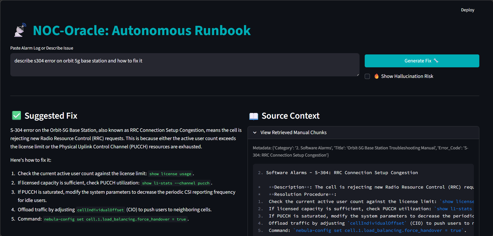
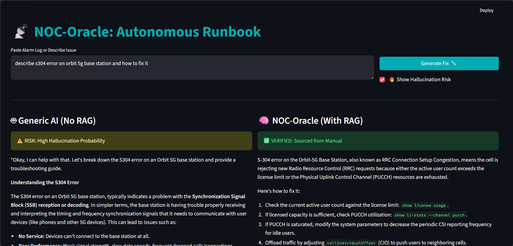
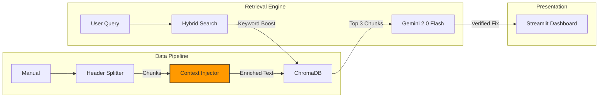

# NOC-Oracle: Autonomous RAG Runbook

> 🔺 **Part of the [TRINITY Project](../README.md)** - An end-to-end AI-powered Network Operations Suite


> **"The Fix" for Alert Fatigue.** A Retrieval-Augmented Generation (RAG) system that maps specific Telecom Error Codes to exact repair procedures using context-aware semantic search.

## ⚡ The Problem: Hallucinations in Ops
Field Engineers cannot rely on generic LLMs (ChatGPT/Gemini) for troubleshooting because they hallucinate commands. A generic model might invent a `reset-network` command that destroys the config. Engineers need **exact, verified procedures** from the official manual.

## 🛡️ The Solution
**NOC-Oracle** ingests technical manuals using a **Context-Aware Chunking Strategy**. It doesn't just read text; it understands the hierarchy of technical documentation, ensuring that "Error S-304" is mathematically linked to its specific "Resolution Procedure."

**New Feature: Hallucination Trap** The dashboard includes a "Show Hallucination Risk" toggle. This runs a side-by-side comparison:
* **Left (Generic AI):** Shows what a standard LLM *would* have guessed (often plausible but dangerous).
* **Right (NOC-Oracle):** Shows the RAG-verified answer sourced strictly from the manual.

## 📸 Interface Modes

### 1. Standard Mode: The Fix
Delivers the verified procedure with source citations.


### 2. Risk Assessment Mode: The Reality Check
Demonstrates why RAG is necessary by exposing the "confident lies" of ungrounded models.


## System Architecture



## Architectural Decisions

### 1. Ingestion: Context-Aware Chunking
* **Decision:** Implemented `MarkdownHeaderTextSplitter` combined with a custom **Metadata Injector**.
* **Reasoning:** Standard splitters (e.g., "every 500 chars") often sever the "Error Code" from its "Solution." By parsing Markdown headers and injecting the Parent Header (e.g., "Hardware Alarms - E-101") into the vector content, we ensure the embedding model treats the code and the fix as a single atomic unit.

### 2. Retrieval: Hybrid Search (Fuzzy Keyword Boosting)
* **Decision:** Implemented a regex-based booster layer before the vector search.
* **Reasoning:** Pure semantic search often fails on specific alphanumeric codes (e.g., `s304` vs `S-304`). We added a logic layer that detects error codes in the query (case-insensitive) and forces the matching chunk to **Rank #1**, guaranteeing retrieval accuracy even with "sloppy" user input.

### 3. Trust Architecture: Source Citation & Risk Toggle
* **Decision:** The UI enforces a split-view layout: "Suggested Fix" (Left) vs. "Source Context" (Right), plus an optional "Hallucination Risk" comparison.
* **Reasoning:** In Enterprise AI, "Black Box" answers are a liability. By forcing the UI to render the raw retrieved chunks alongside the AI answer, we provide the **Explainability** required for NOC operations.

## Tech Stack
* **Runtime:** Python 3.12+ (uv)
* **LLM:** Google Gemini 2.0 Flash
* **Orchestration:** LangChain
* **Vector DB:** ChromaDB (Persistent)
* **Embeddings:** `models/text-embedding-004`
* **Frontend:** Streamlit

## ⚠️ Known Issues
**Google Generative AI SDK Deprecation:**  
The `google-generativeai` package is deprecated and support ended as of January 2025. Migration to `google-genai` is required before **June 24, 2026**. The current implementation works but will need updating. See [migration guide](https://ai.google.dev/gemini-api/docs/migrate) for details.

## Quick Start

```bash
# 1. Install dependencies
uv sync

# 2. Setup Secrets
cp .env.example .env
# Edit .env and add your GEMINI_API_KEY=...

# 3. Generate Synthetic Manual
# Creates a realistic telecom troubleshooting manual with error codes,
# symptoms, and verified resolution procedures
uv run src/generators.py

# 4. Ingest & Index
# Processes the manual using context-aware chunking and stores
# embeddings in ChromaDB for semantic retrieval
uv run src/ingestor.py

# 5. Run the Dashboard
uv run streamlit run src/app.py
```

## Testing

```bash
# Install development dependencies
uv sync --extra dev

# Run all tests
pytest tests/

# Run with verbose output
pytest tests/ -v
```

## License

This project is licensed under the MIT License - see the [LICENSE](LICENSE) file for details.
