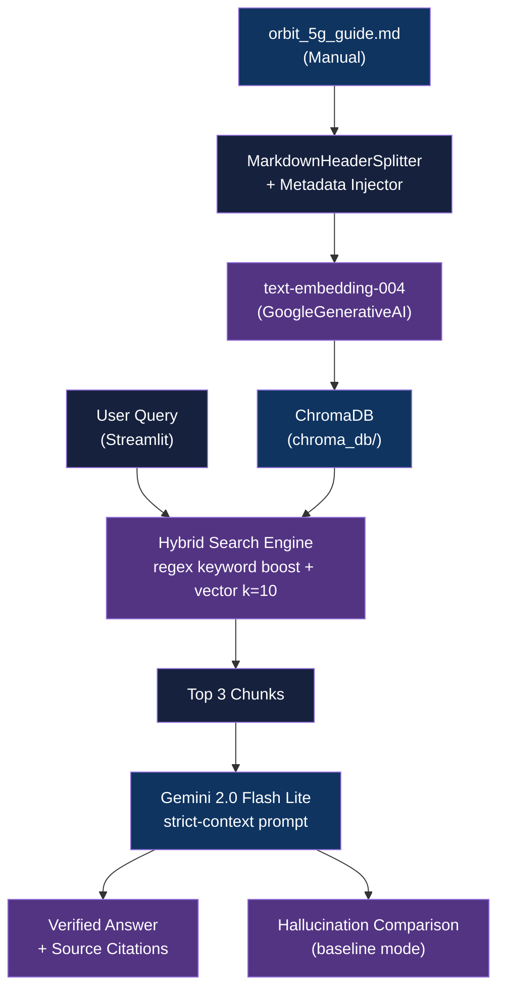
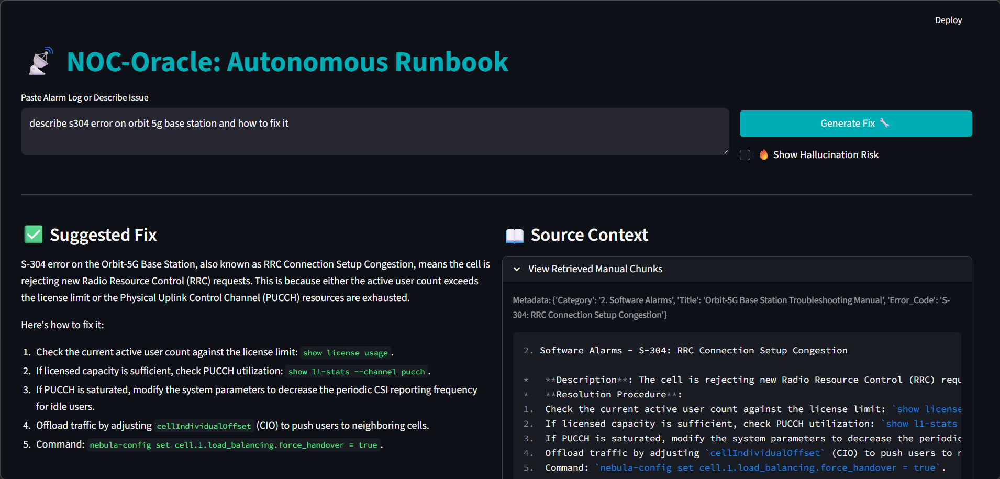
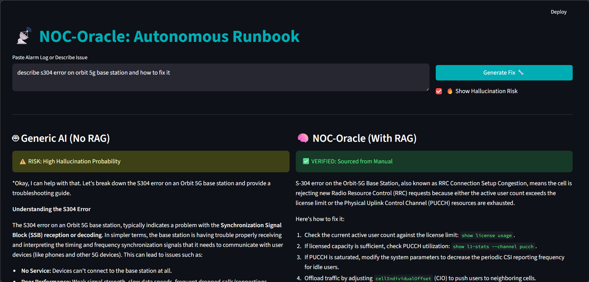

<div align="center">

# NOC-Oracle

[](https://www.python.org/downloads/)
[](https://github.com/astral-sh/uv)
[](https://ai.google.dev/gemini-api/docs/models)
[](https://streamlit.io/)
[](LICENSE)

**Telecom runbook RAG engine mapping error codes to verified procedures via hybrid search and Gemini 2.0 Flash.**

[Getting Started](#getting-started) | [Usage](#usage) | [Architecture](#architecture)

</div>

---

## Table of Contents

- [The Problem](#the-problem)
- [Features](#features)
- [Tech Stack](#tech-stack)
- [Architecture](#architecture)
- [Demo](#demo)
- [Getting Started](#getting-started)
  - [Prerequisites](#prerequisites)
  - [Installation](#installation)
  - [Configuration](#configuration)
- [Usage](#usage)
- [Architectural Decisions](#architectural-decisions)
- [Project Structure](#project-structure)
- [Testing](#testing)
- [Known Issues](#known-issues)
- [Related Projects](#related-projects)
- [License](#license)
- [Author](#author)

## The Problem

### Alert Fatigue in NOC Operations

Field engineers troubleshooting telecom alarms cannot rely on generic LLMs: a model without grounding in the specific device manual will invent plausible-sounding commands that can corrupt live configuration. Engineers need exact, verified procedures tied to specific error codes like `S-304` or `E-101`.

### The Solution

NOC-Oracle ingests the device manual with context-aware header-based chunking, stores enriched embeddings in ChromaDB, and retrieves with a hybrid search layer that prioritizes exact error code matches. A Streamlit dashboard surfaces the RAG-verified answer alongside the raw source chunks, and optionally runs a side-by-side hallucination comparison against an ungrounded baseline.

## Features

- **Context-aware chunking** - `MarkdownHeaderTextSplitter` preserves the parent header (category + error code) in each embedded chunk, keeping error codes mathematically linked to their resolution steps
- **Hybrid search** - regex-based keyword booster normalizes alphanumeric codes (`s304` -> `S304`) and forces the matching chunk to rank first before vector reranking
- **Hallucination comparison toggle** - side-by-side view shows generic LLM output vs. RAG-verified answer to demonstrate grounding value
- **Source citation** - every answer renders the retrieved manual chunks alongside the response for explainability
- **Persisted vector index** - ChromaDB index stored in `chroma_db/` survives restarts without re-ingestion
- **Synthetic manual generator** - Gemini-powered generator creates a realistic Orbit-5G Base Station troubleshooting guide for demo use

## Tech Stack

| Component | Technology |
|-----------|------------|
| Language | Python 3.12+ (uv) |
| LLM | Gemini 2.0 Flash Lite (`gemini-2.0-flash-lite`) |
| Embeddings | `models/text-embedding-004` (Google) |
| Orchestration | LangChain + LangChain-Chroma |
| Vector DB | ChromaDB (persistent) |
| Frontend | Streamlit |

## Architecture


```mermaid
graph TD
    A["orbit_5g_guide.md\n(Manual)"] --> B["MarkdownHeaderSplitter\n+ Metadata Injector"]
    B --> C["text-embedding-004\n(GoogleGenerativeAI)"]
    C --> D["ChromaDB\n(chroma_db/)"]

    E["User Query\n(Streamlit)"] --> F["Hybrid Search Engine\nregex keyword boost + vector k=10"]
    D --> F
    F --> G["Top 3 Chunks"]
    G --> H["Gemini 2.0 Flash Lite\nstrict-context prompt"]
    H --> I["Verified Answer\n+ Source Citations"]
    H --> J["Hallucination Comparison\n(baseline mode)"]

    style A fill:#0f3460,color:#fff
    style B fill:#16213e,color:#fff
    style C fill:#533483,color:#fff
    style D fill:#0f3460,color:#fff
    style E fill:#16213e,color:#fff
    style F fill:#533483,color:#fff
    style G fill:#16213e,color:#fff
    style H fill:#0f3460,color:#fff
    style I fill:#533483,color:#fff
    style J fill:#533483,color:#fff
```

## Demo

| Mode | Screenshot |
|------|------------|
| Standard - verified fix + source citations |  |
| Hallucination Risk - RAG vs. ungrounded baseline |  |

## Getting Started

### Prerequisites

- Python 3.12+
- [uv](https://docs.astral.sh/uv/) package manager
- Google Gemini API key (from [Google AI Studio](https://aistudio.google.com/))

### Installation

1. Clone the repository:
   ```bash
   git clone https://github.com/adityonugrohoid/noc-oracle.git
   cd noc-oracle
   ```

2. Install dependencies:
   ```bash
   uv sync
   ```

### Configuration

```bash
cp .env.example .env
```

Edit `.env` and set your API key:

<details>
<summary>Configuration reference</summary>

```bash
# Required
GEMINI_API_KEY=your_gemini_api_key_here
```

</details>

## Usage

Run each step once in sequence. The generated manual and ChromaDB index persist across restarts.

```bash
# 1. Generate the synthetic Orbit-5G troubleshooting manual
uv run src/generators.py

# 2. Ingest the manual into ChromaDB (context-aware chunking + embedding)
uv run src/ingestor.py

# 3. Launch the Streamlit dashboard
uv run streamlit run src/app.py
```

Open the dashboard, type an alarm log or error code (e.g., `How do I fix S-304 alarm?`), and click **Generate Fix**. Enable **Show Hallucination Risk** to compare RAG output against an ungrounded baseline.

## Architectural Decisions

### 1. Context-aware chunking via `MarkdownHeaderTextSplitter`

**Decision:** Split the manual on Markdown headers (`#` Title, `##` Category, `###` Error_Code) and inject the parent header text back into each chunk's `page_content` before embedding.

**Reasoning:** Standard fixed-size splitters sever the error code from its resolution procedure when a chunk boundary falls in between. By prepending `Category - Error_Code` to every chunk, the embedding model treats the code and the fix as a single atomic unit, ensuring that a query for `E-101` retrieves the hardware alarm resolution rather than an unrelated passage.

### 2. Regex-based keyword boosting in hybrid search

**Decision:** Before returning similarity search results, extract error code patterns from the query (`\b[A-Za-z]+-?\d+\b`), normalize both query codes and document content (strip hyphens, uppercase), and promote matching documents to the front of the result list.

**Reasoning:** Pure semantic search mishandles specific alphanumeric codes. `s304` and `S-304` produce different embeddings. The regex booster bridges this gap without a separate BM25 index, keeping the dependency surface minimal while ensuring exact code matches rank first.

### 3. Strict-context prompt with hallucination toggle

**Decision:** The LLM prompt instructs the model to answer exclusively from the retrieved context chunks. The UI exposes a toggle that calls `get_baseline_response` (no context) alongside the RAG answer.

**Reasoning:** In NOC operations, an unattributed "confident lie" is a safety liability. Forcing source citations into every answer provides explainability. The hallucination toggle makes the RAG value proposition visible rather than implicit, useful for demos and onboarding.

## Project Structure

```
noc-oracle/
├── src/
│   ├── app.py              # Streamlit dashboard
│   ├── engine.py           # NOCEngine: hybrid search + Gemini generation
│   ├── ingestor.py         # Manual ingestor: chunking, embedding, ChromaDB write
│   ├── generators.py       # Synthetic manual generator via Gemini
│   └── __init__.py
│
├── tests/
│   ├── test_engine.py      # Unit tests for NOCEngine (hybrid search, retrieval)
│   ├── test_ingestor.py    # Ingestor tests
│   └── test_generators.py  # Generator tests
│
├── data/
│   └── manuals/
│       └── orbit_5g_guide.md   # Generated troubleshooting manual
│
├── chroma_db/              # Persisted ChromaDB vector index (gitignored)
├── assets/                 # Dashboard screenshots
├── .env.example            # Configuration template
└── pyproject.toml          # Project metadata and dependencies (uv)
```

## Testing

```bash
# Install dev dependencies
uv sync --extra dev

# Run all tests
pytest tests/ -v

# Run a specific module
pytest tests/test_engine.py -v
```

## Known Issues

| Issue | Impact | Workaround |
|-------|--------|------------|
| `google-generativeai` SDK deprecated (support ended Jan 2025) | Will break after June 24, 2026 | Migrate to `google-genai`; see the [migration guide](https://ai.google.dev/gemini-api/docs/migrate) |

## Related Projects

| Project | Description |
|---------|-------------|
| [incident-commander](https://github.com/adityonugrohoid/incident-commander) | Async log analyzer batching noisy error streams into structured incident reports (Gemini 2.0 Flash Lite) |
| [net-ops-agent](https://github.com/adityonugrohoid/net-ops-agent) | Agentic network-ops assistant with mandatory human approval (Gemini 2.0 Flash function calling) |

## License

This project is licensed under the [MIT License](LICENSE).

## Author

**Adityo Nugroho** ([@adityonugrohoid](https://github.com/adityonugrohoid))
